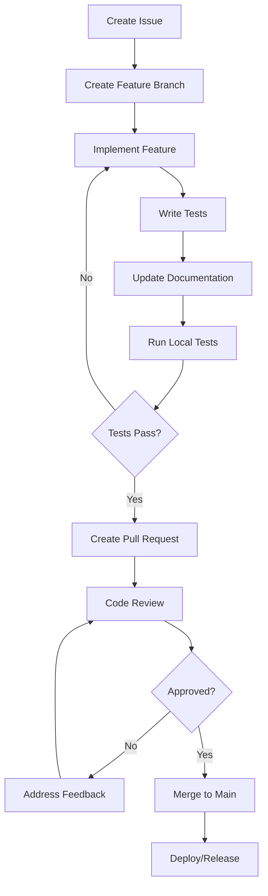
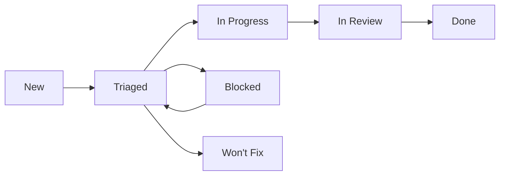

# Development Workflows

This document outlines the development workflows, processes, and best practices for the ProbNeural Operator Lab project.

## Table of Contents

1. [Git Workflow](#git-workflow)
2. [Development Process](#development-process)
3. [Code Review](#code-review)
4. [Testing Strategy](#testing-strategy)
5. [Release Process](#release-process)
6. [CI/CD Pipeline](#cicd-pipeline)
7. [Documentation Workflow](#documentation-workflow)
8. [Issue Management](#issue-management)

## Git Workflow

### Branching Strategy

We follow a **GitHub Flow** with additional structure for releases:

```
main (protected)
├── feature/feature-name
├── bugfix/issue-description
├── hotfix/critical-fix
├── release/v1.0.0
└── develop (optional for complex features)
```

### Branch Naming Convention

- `feature/short-description` - New features
- `bugfix/issue-description` - Bug fixes
- `hotfix/critical-fix` - Urgent fixes for production
- `release/v1.0.0` - Release preparation
- `docs/topic` - Documentation updates
- `refactor/component-name` - Code refactoring
- `test/test-description` - Test improvements

### Commit Message Format

We follow [Conventional Commits](https://www.conventionalcommits.org/):

```
<type>[optional scope]: <description>

[optional body]

[optional footer(s)]
```

**Types:**
- `feat`: A new feature
- `fix`: A bug fix
- `docs`: Documentation only changes
- `style`: Changes that do not affect the meaning of the code
- `refactor`: A code change that neither fixes a bug nor adds a feature
- `perf`: A code change that improves performance
- `test`: Adding missing tests or correcting existing tests
- `chore`: Changes to the build process or auxiliary tools

**Examples:**
```bash
feat(uncertainty): add Linearized Laplace approximation
fix(models): resolve GPU memory leak in FNO training
docs(api): update uncertainty quantification examples
test(integration): add end-to-end workflow tests
```

## Development Process

### 1. Setting Up Development Environment

```bash
# Clone repository
git clone https://github.com/your-org/probneural-operator-lab.git
cd probneural-operator-lab

# Set up development environment
make setup-dev

# Install pre-commit hooks
pre-commit install

# Run initial tests
make test
```

### 2. Feature Development Workflow



### 3. Daily Development Routine

1. **Start of Day:**
   ```bash
   git checkout main
   git pull origin main
   git checkout -b feature/your-feature
   ```

2. **During Development:**
   ```bash
   # Regular commits
   git add .
   git commit -m "feat: implement feature component"
   
   # Run tests frequently
   make test-unit
   
   # Check code quality
   make lint
   ```

3. **End of Day:**
   ```bash
   git push origin feature/your-feature
   ```

## Code Review

### Review Checklist

**Functionality:**
- [ ] Code implements the intended functionality
- [ ] Edge cases are handled appropriately
- [ ] Error handling is comprehensive
- [ ] Performance considerations are addressed

**Code Quality:**
- [ ] Code follows project style guidelines
- [ ] Variable and function names are descriptive
- [ ] Code is well-structured and modular
- [ ] No code duplication
- [ ] Comments explain complex logic

**Testing:**
- [ ] New functionality has corresponding tests
- [ ] Tests cover edge cases and error conditions
- [ ] All tests pass
- [ ] Test coverage is maintained or improved

**Documentation:**
- [ ] Public APIs are documented
- [ ] Complex algorithms are explained
- [ ] README/docs are updated if needed
- [ ] Examples are provided for new features

**Security:**
- [ ] No sensitive information in code/commits
- [ ] Input validation is present
- [ ] Dependencies are secure
- [ ] No obvious security vulnerabilities

### Review Process

1. **Author Responsibilities:**
   - Self-review before requesting review
   - Provide clear PR description
   - Respond to feedback promptly
   - Update based on review comments

2. **Reviewer Responsibilities:**
   - Review within 24-48 hours
   - Provide constructive feedback
   - Test complex changes locally
   - Approve when requirements are met

3. **Review Guidelines:**
   - Be respectful and constructive
   - Focus on code, not the person
   - Explain the "why" behind suggestions
   - Acknowledge good practices

## Testing Strategy

### Test Pyramid

```
    /\
   /  \
  / E2E \     End-to-End Tests (few, slow, high confidence)
 /______\
 \      /
  \ IT /      Integration Tests (some, medium speed)
   \__/
   \  /
    \/        Unit Tests (many, fast, focused)
```

### Test Categories

1. **Unit Tests** (`tests/unit/`)
   - Test individual functions/classes
   - Fast execution (< 1 second each)
   - High code coverage target (>90%)
   - Mocked dependencies

2. **Integration Tests** (`tests/integration/`)
   - Test component interactions
   - Real dependencies when possible
   - Medium execution time (< 30 seconds each)
   - Focus on critical workflows

3. **End-to-End Tests** (`tests/e2e/`)
   - Test complete user scenarios
   - Real environment setup
   - Longer execution time (< 5 minutes each)
   - Cover main use cases

4. **Performance Tests** (`tests/benchmarks/`)
   - Measure execution time and memory usage
   - Detect performance regressions
   - Run on representative data sizes

### Test Execution

```bash
# Run all tests
make test

# Run specific test categories
make test-unit
make test-integration
make test-e2e
make test-benchmarks

# Run with coverage
make test-coverage

# Run specific test file
pytest tests/unit/test_models.py -v

# Run tests matching pattern
pytest -k "test_fno" -v
```

### Testing Best Practices

- **Write tests first** (TDD approach when appropriate)
- **One assertion per test** when possible
- **Use descriptive test names** that explain the scenario
- **Test edge cases and error conditions**
- **Keep tests independent** - no shared state
- **Use fixtures** for common test setup
- **Mock external dependencies** in unit tests

## Release Process

### Version Numbering

We follow [Semantic Versioning](https://semver.org/):

- **MAJOR** (1.0.0): Breaking changes
- **MINOR** (0.1.0): New features, backwards compatible
- **PATCH** (0.0.1): Bug fixes, backwards compatible
- **Pre-release** (1.0.0-alpha.1): Alpha, beta, rc versions

### Release Workflow

1. **Prepare Release:**
   ```bash
   # Create release branch
   git checkout -b release/v1.0.0
   
   # Update version numbers
   # Update CHANGELOG.md
   # Update documentation
   
   git commit -m "chore: prepare release v1.0.0"
   git push origin release/v1.0.0
   ```

2. **Create Release PR:**
   - PR from release branch to main
   - Include changelog and version updates
   - Run full test suite
   - Get approval from maintainers

3. **Tag and Release:**
   ```bash
   git checkout main
   git pull origin main
   git tag v1.0.0
   git push origin v1.0.0
   ```

4. **Automated Release:**
   - GitHub Actions automatically builds and publishes
   - Docker images are built and pushed
   - PyPI package is published
   - GitHub release is created

### Release Checklist

**Pre-Release:**
- [ ] All tests pass
- [ ] Documentation is updated
- [ ] CHANGELOG.md is updated
- [ ] Version numbers are updated
- [ ] Breaking changes are documented
- [ ] Migration guide is provided (if needed)

**Release:**
- [ ] Tag is created
- [ ] GitHub release is published
- [ ] PyPI package is published
- [ ] Docker images are pushed
- [ ] Documentation is deployed

**Post-Release:**
- [ ] Release announcement
- [ ] Update dependent projects
- [ ] Monitor for issues
- [ ] Plan next release

## CI/CD Pipeline

### Continuous Integration

Our CI pipeline runs on every push and pull request:

1. **Code Quality:**
   - Linting with flake8
   - Formatting with black
   - Import sorting with isort
   - Type checking with mypy
   - Security scanning with bandit

2. **Testing:**
   - Unit tests with pytest
   - Integration tests
   - Performance benchmarks
   - GPU tests (when available)

3. **Build & Package:**
   - Package building
   - Installation testing
   - Documentation building

4. **Security:**
   - Dependency vulnerability scanning
   - Secret detection
   - License compliance

### Continuous Deployment

Deployment is triggered by:
- **Main branch pushes**: Deploy to staging
- **Tagged releases**: Deploy to production
- **Manual triggers**: Deploy specific versions

### Pipeline Configuration

The pipeline is defined in:
- `.github/workflows/ci.yml` - Main CI pipeline
- `.github/workflows/release.yml` - Release pipeline
- `.github/workflows/dependency-update.yml` - Dependency updates

## Documentation Workflow

### Documentation Types

1. **API Documentation:**
   - Auto-generated from docstrings
   - Updated with code changes
   - Include examples and usage

2. **User Guides:**
   - Getting started tutorials
   - Feature guides
   - Best practices

3. **Developer Documentation:**
   - Architecture decisions
   - Development setup
   - Contributing guidelines

### Documentation Process

1. **Write Documentation:**
   ```bash
   # Edit documentation files
   cd docs/
   # Make changes to .md or .rst files
   
   # Build locally
   make html
   
   # View in browser
   open _build/html/index.html
   ```

2. **Review Process:**
   - Documentation changes go through same review as code
   - Technical accuracy is verified
   - Writing clarity is checked

3. **Publication:**
   - Documentation is automatically built and deployed
   - Available at project documentation site
   - Updated with each release

## Issue Management

### Issue Types

- **Bug Report**: Something is broken
- **Feature Request**: New functionality
- **Enhancement**: Improve existing functionality
- **Documentation**: Documentation improvements
- **Question**: General questions or support

### Issue Lifecycle



### Labels and Milestones

**Priority Labels:**
- `priority/critical` - Urgent, needs immediate attention
- `priority/high` - Important, should be next
- `priority/medium` - Normal priority
- `priority/low` - Nice to have

**Type Labels:**
- `type/bug` - Bug reports
- `type/feature` - New features
- `type/enhancement` - Improvements
- `type/docs` - Documentation
- `type/question` - Questions

**Status Labels:**
- `status/in-progress` - Currently being worked on
- `status/blocked` - Blocked by external dependency
- `status/needs-review` - Needs code review
- `status/needs-testing` - Needs testing

### Issue Templates

We provide templates for:
- Bug reports
- Feature requests
- Documentation improvements
- Security vulnerabilities

## Best Practices Summary

### General Guidelines

1. **Keep changes small and focused**
2. **Write clear commit messages**
3. **Test thoroughly before submitting**
4. **Document your changes**
5. **Follow code style guidelines**
6. **Be responsive to feedback**
7. **Help review others' code**

### Quality Gates

Before merging:
- [ ] All CI checks pass
- [ ] Code review approved
- [ ] Tests added/updated
- [ ] Documentation updated
- [ ] No merge conflicts

### Communication

- Use GitHub issues for tracking work
- Tag reviewers explicitly
- Provide context in PRs
- Update issue status regularly
- Ask for help when stuck

## Tools and Resources

### Development Tools

- **IDE**: VS Code with recommended extensions
- **Linting**: flake8, black, isort, mypy
- **Testing**: pytest, coverage
- **Documentation**: Sphinx, Markdown
- **Git**: pre-commit hooks, conventional commits

### Useful Commands

```bash
# Development environment
make setup-dev          # Set up development environment
make clean              # Clean build artifacts
make format             # Format code
make lint               # Run linting
make test               # Run tests
make docs               # Build documentation

# Git helpers
git log --oneline -10   # Recent commits
git status              # Check status
git diff                # See changes
git checkout main       # Switch to main
git pull origin main    # Update main

# Docker helpers
make docker-build       # Build Docker images
make docker-test        # Run tests in Docker
make docker-clean       # Clean Docker artifacts
```

This workflow documentation ensures consistent, high-quality development practices across the team while maintaining flexibility for different types of contributions.